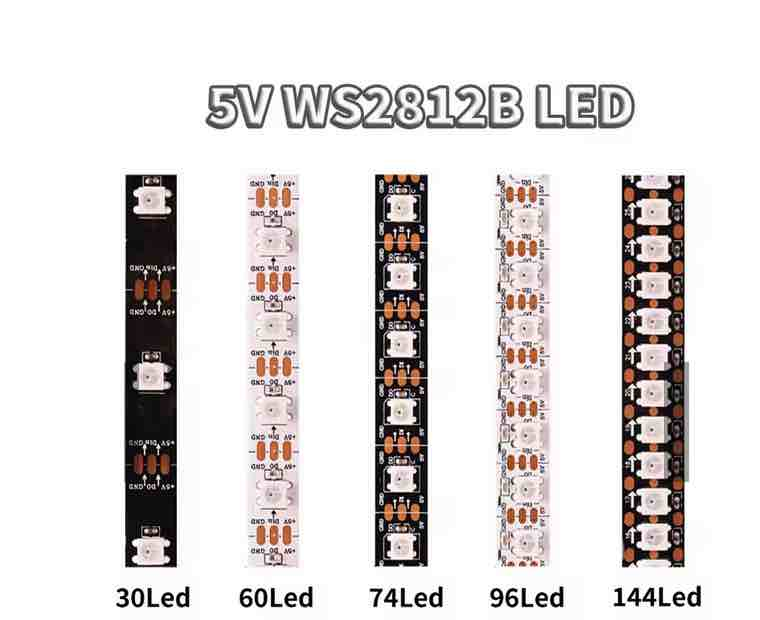
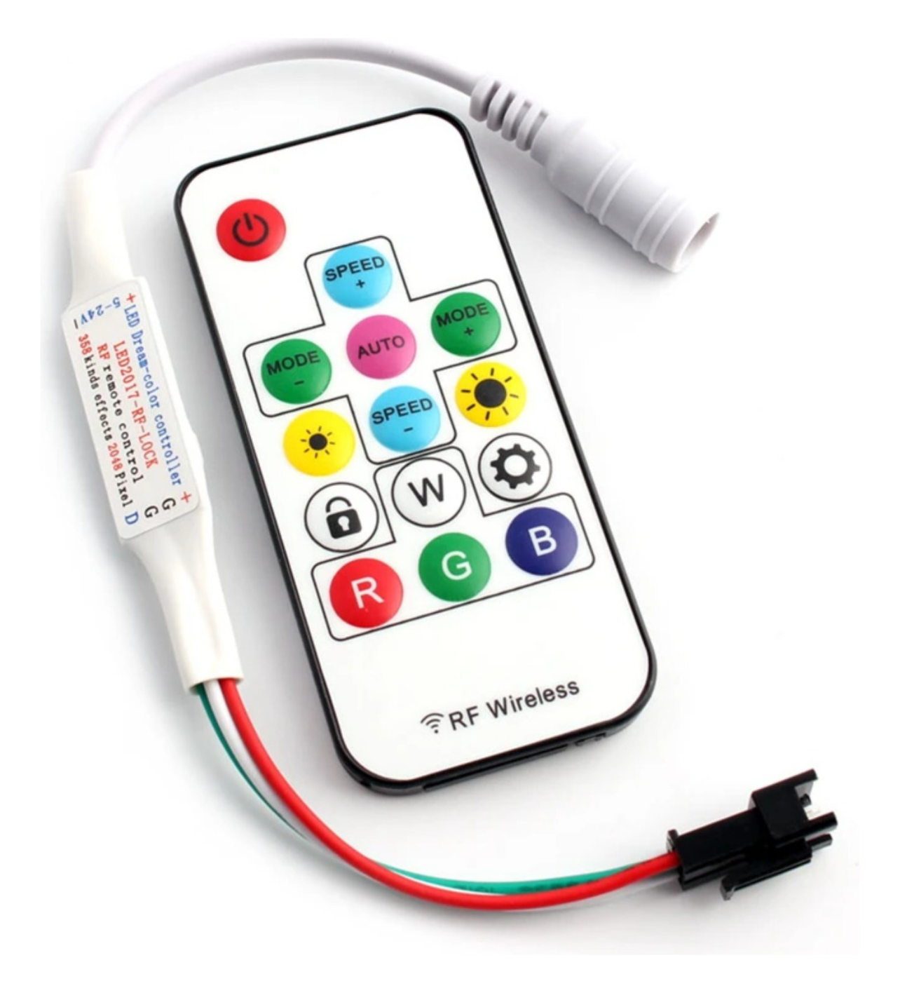
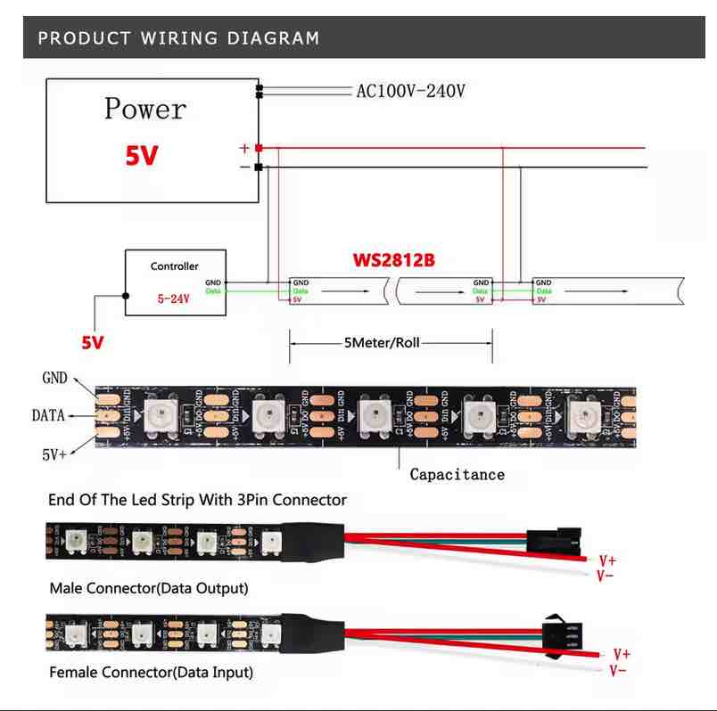
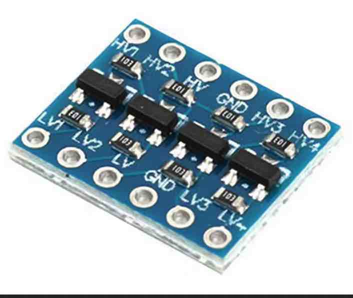
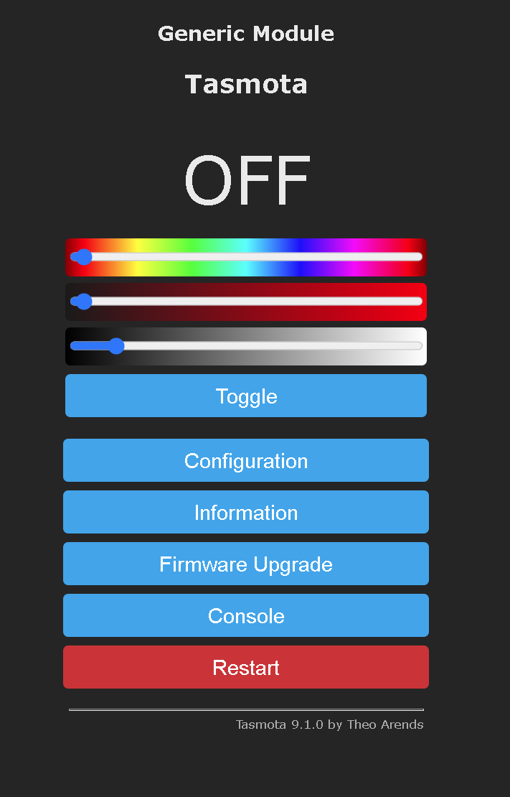
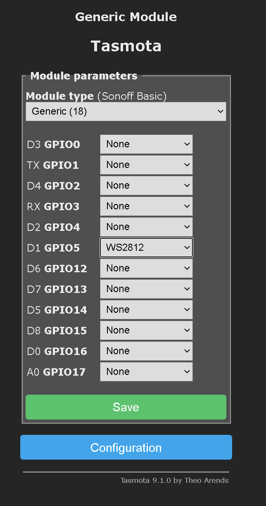
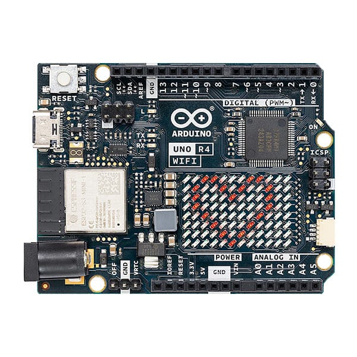

<p align="center">
  
</p>

# Fita LED WS2812B

Este repositório demonstra como controlar uma fita de LED WS2812B (NeoPixel) utilizando:

- Um **ESP32** com Wi-Fi integrado
- Ou um **Arduino UNO R4 WiFi** com sua matriz de LED on-board e suporte a Wi-Fi

Ambas as plataformas apresentam:

- Uma **interface web responsiva**
- **Botões interativos via AJAX** para:
  - Selecionar efeitos de iluminação
  - Ajustar a velocidade das animações
  - Controlar o brilho dos LEDs

Além disso, é possível configurar o controle via **firmware TASMOTA**, ideal para integração com sistemas MQTT e automação residencial.


[Fita LED WS2812B RGB 5V no AliExpress](https://pt.aliexpress.com/item/1005007989431712.html?srcSns=sns_Copy&spreadType=socialShare&bizType=ProductDetail&social_params=21851383776&aff_fcid=6abde431cf2c43d78abba54f8fe92092-1748561979491-00334-_mq1jYKF&tt=MG&aff_fsk=_mq1jYKF&aff_platform=default&sk=_mq1jYKF&aff_trace_key=6abde431cf2c43d78abba54f8fe92092-1748561979491-00334-_mq1jYKF&shareId=21851383776&businessType=ProductDetail&platform=AE&terminal_id=fb8fc465198c41748a4019f7189cdc36&afSmartRedirect=y)

<p align="center">
  
</p>

## 📑 Índice

- [I - Introdução](#i---introdução)
- [II - Fita LED WS2812B](#ii---Fita-led-ws2812b)
- [III - Conversor de Nível Lógico para WS2812B com ESP32](#iii---conversor-de-nível-lógico-para-ws2812b-com-esp32)
- [IV - Projeto para que o ESP32-WROOM controle a fita WS2812B por uma página web, com um botão HTML que alterna entre os efeitos (arco-íris, correr, teclado).](#iv---projeto-para-que-o-esp32-wroom-controle-a-fita-ws2812b-por-uma-página-web-com-um-botão-html-que-alterna-entre-os-efeitos-arco-íris-correr-teclado)
- [V - Controle da Fita WS2812B com firmware Tasmota](#v---controle-da-fita-ws2812b-com-firmware-tasmota)
- [VI - Fita de LED com Arduino UNO R4 WIFI](#vi---fita-de-led-com-arduino-uno-r4-wifi)

---

# I - Introdução

A forma mais simples de controlar esta fita de led endereçável é através do controlador RF. Esta forma de controle não é  o objeto deste repositório, mas estes controladores são de baixo custo e facilmente encontrados no mercado. 

O controlador RF compacto foi desenvolvido para o controle de fitas de LED endereçáveis, permitindo a seleção remota de múltiplos efeitos visuais com praticidade e versatilidade. Compatível com os principais chips de controle digital como WS2812B, APA102 e similares, o dispositivo suporta centenas de modos pré-programados, ajuste de velocidade, número de pixels e armazenamento automático do último estado utilizado.  

<p align="center">
  
</p>

Sua operação é feita via controle remoto por rádio frequência (433,92 MHz), com alcance de até 20 metros e alta sensibilidade. O controlador é ideal para projetos de iluminação decorativa, efeitos visuais dinâmicos e sistemas de automação residencial, sendo fácil de instalar e alimentar com tensões entre 5V e 24V DC.  

O uso de fitas de LED endereçáveis  com microcontroladores ESP32  permite criar sistemas de iluminação altamente personalizáveis e interativos.  Para simplificar a integração com redes Wi-Fi e plataformas de automação, pode-se utilizar o firmware Tasmota, que transforma o microcontrolador em um dispositivo configurável via navegador, com suporte embutido para efeitos, comandos MQTT e atualizações OTA. 

Assim sendo  é possível configurar a fita diretamente pela interface web e controlá-la via comandos MQTT, HTTP ou por integração automática com sistemas como Home Assistant, permitindo acionamento por horários, sensores ou comandos de voz. Alternativamente, quem usa código próprio no ESP32 pode desenvolver lógicas customizadas e publicar mensagens via MQTT, mantendo compatibilidade com Home Assistant ou Node-RED. Essa arquitetura híbrida oferece flexibilidade, escalabilidade e confiabilidade tanto para automações residenciais quanto para instalações profissionais, com controle total da iluminação, consumo e resposta em tempo real.

---


# II - Fita LED WS2812B


## 🔧 Características principais

- **Tipo de LED:** WS2812B (com controlador embutido em cada LED)
- **Tensão de operação:** 5V DC
- **Comunicação:** 1 fio (protocolo serial)
- **Controle individual:** Cada LED pode ter cor e brilho próprios
- **Cores:** RGB (16 milhões de cores, controle PWM de 8 bits por canal)
- **Consumo:** ~60 mA por LED em brilho máximo (branco total)
- **Frequência de atualização:** Até 800 KHz
- **Endereçamento:** Dados em cascata (de um LED para o próximo)
- **Corte:** A cada LED ou grupo de LEDs (ver marcações na fita)

---

## 🛠️ Ligações básicas

<p align="center">
  
</p>

| Fita WS2812B | Função                            |
|--------------|-----------------------------------|
| **+5V**       | Alimentação                       |
| **GND**       | Terra (referência)               |
| **DIN**       | Entrada de dados (microcontrolador → fita) |
| **DOUT**      | Saída de dados (para próxima fita) |

> ⚠️ **Atenção:** Para microcontroladores de 3,3V (ESP32, Raspberry Pi), use **conversor de nível lógico** para o sinal de dados.

--- 

## 🔧 Características da fita utilizada

**Escala Cinzenta:** 256  
**Bits/Cor:** 8 Bits/Cor  

## Largura do PCB:
- 30 LEDs/m — 10mm  
- 60 LEDs/m — 10mm  
- 74 LEDs/m — 10mm  
- 96 LEDs/m — 10mm  
- 144 LEDs/m — 12mm  

**Cor FPC:** Preto/Branco  

**Taxa de Proteção:** IP30 / IP65 / IP67  

**Cores:** RGB em cores, mudança de cor de sonho  

**Cortável:** Cada LED é cortável  
 
**Double-sided copper**  
  - Folha de cobre de 35μm usada, com boa condutividade e redução de tensão
 
## 🧠 Aplicações comuns

- Iluminação RGB de ambientes
- Decoração de festas e Natal
- Ambientes gamers (modding de PC)
- Painéis e letreiros visuais
- Robótica e cosplay com luzes dinâmicas
- Luzes reativas a som

## ✅ Vantagens

- Controle individual por LED
- Integração fácil com microcontroladores
- Flexível, cortável e expansível
- Suporte por bibliotecas (FastLED, NeoPixel)

## ❌ Desvantagens

- Precisa de alimentação 5V estável
- Sensível a ruídos em longas distâncias
- Pode exigir capacitor e resistor para proteção
---

# III - Conversor de Nível Lógico para WS2812B com ESP32

## 📌 O que é um conversor de nível lógico?

Um **conversor de nível lógico** é um circuito que adapta sinais elétricos entre dispositivos que operam em diferentes tensões, como **3,3V** e **5V**.

---

## ⚠️ Por que é necessário?

Dispositivos como o **ESP32** ou **Raspberry Pi** operam em **3,3V**, enquanto a fita **WS2812B** geralmente requer sinais de **~5V** para funcionar de forma confiável.

Sem esse ajuste de nível:

- O sinal de dados de 3,3V pode não ser reconhecido corretamente pela fita.
- Isso pode causar efeitos como:
  - LEDs piscando incorretamente
  - Falhas intermitentes
  - LEDs travados

---

## ✅ Formas de conexão 

### 1. Módulo Conversor de Nível Lógico Bidirecional (MOSFET BSS138)

- Compatível com sinais de alta velocidade como o da WS2812B.
- Terminais:
  - **HV**: 5V da fonte
  - **LV**: 3,3V do ESP32
  - **GND**: comum entre ESP32 e fita
  - **LV1 → GPIO do ESP32**, **HV1 → DIN da fita WS2812B**

### 2. CI TTL Compatível: 74HCT245 ou 74HCT125

- Recomendado para buffers compatíveis com 3,3V.
- Usado para garantir a integridade do sinal em sistemas mais robustos.

### 3. Divisor Resistivo (não recomendado para WS2812B)

- Exemplo: Resistores de 1kΩ e 2kΩ.
- Reduz tensão de 5V para 3,3V, mas **não funciona bem para sinais rápidos** como os da WS2812B.

### 4. 🔌 Usando o Conversor de Nível Lógico IIC/I2C 

O módulo conhecido como **Conversor de Nível Lógico IIC/I2C bidirecional 5V ↔ 3.3V** (geralmente baseado no **MOSFET BSS138**) pode ser usado com segurança para **controlar fitas WS2812B** usando microcontroladores de 3,3V como o **ESP32**.

<p align="center">
  
</p>

Apesar de rotulado como “I2C”, esse módulo é um **conversor de nível lógico genérico**, ideal para sinais digitais de entrada/saída. O sinal da WS2812B:

- É **digital**
- É **unidirecional** (do ESP32 para a fita)
- Opera em **alta frequência (~800kHz)**

---

## 🔌 Exemplo de ligação

Use apenas **um canal** do conversor. Exemplo usando o canal **LV1/HV1**:

| Pino no Conversor | Conectar a                  |
|-------------------|-----------------------------|
| **HV**            | 5V da fonte da fita         |
| **LV**            | 3,3V do ESP32               |
| **GND**           | GND comum (ESP32 e fonte)   |
| **LV1**           | GPIO do ESP32 (ex: GPIO5)   |
| **HV1**           | DIN da fita WS2812B         |

> Os outros canais (LV2/HV2, etc.) não precisam ser usados.

---

# IV - Projeto para que o ESP32-WROOM controle a fita WS2812B por uma página web, com um botão HTML que alterna entre os efeitos (arco-íris, correr, teclado).

## 📦 Requisitos

- ESP32-WROOM
- Fita LED WS2812B (5V)
- Conversor de sinis lógicos 
- Fonte externa 5V (capaz de fornecer corrente suficiente)
- Arduino IDE com suporte à placa ESP32
- Biblioteca: [Adafruit NeoPixel](https://github.com/adafruit/Adafruit_NeoPixel)

---

## 🔧 Conexões da fita ao ESP32

| Fita WS2812B | ESP32                  |
|--------------|------------------------|
| DIN          | GPIO 5  (conversor)    |
| GND          | GND                    |
| +5V          | Fonte 5V               |

**Importante:** Conecte o GND da fonte e do ESP32 em comum.


## 🚀 Funcionalidades

- Servidor Web embutido no ESP32.
- Interface HTML moderna e responsiva (compatível com smartphones).
- Seis efeitos visuais:
  - Arco-íris contínuo
  - Correr (Knight Rider)
  - Teclado (preencher e apagar)
  - Piscada dupla
  - Chuva de LEDs
  - Branco estático
- Botões para:
  - Selecionar efeitos
  - Aumentar / diminuir **velocidade**
  - Aumentar / diminuir **brilho**
- Comunicação via AJAX (sem recarregar a página).

---

## 🌐 Interface Web

Acesse via navegador após o ESP32 se conectar à rede.  
Use o IP exibido no Serial Monitor, ex:

```plaintext
Conectado! IP: 192.168.0.105
```

## 📸 Controles disponíveis

- **Seção de efeitos:** Botões nomeados por efeito
- **Velocidade:** "Mais rápido" / "Mais lento"
- **Brilho:** "Aumentar" / "Diminuir"

---

## 🛠️ Como usar

1. Instale a biblioteca **Adafruit NeoPixel** na IDE do Arduino.
2. Substitua as credenciais de Wi-Fi no código:
   ```cpp
   const char* ssid = "SEU_SSID";
   const char* password = "SUA_SENHA";
   ```
3. Faça o upload do código para o ESP32.
4. Abra o navegador e acesse o IP mostrado no monitor serial.

---

## 📁 Estrutura do código

| Função                  | Descrição                                         |
|-------------------------|--------------------------------------------------|
| `setup()`               | Inicializa Wi-Fi, LEDs e servidor HTTP           |
| `loop()`                | Executa o efeito atual continuamente             |
| `/`                     | Rota principal: exibe a interface HTML           |
| `/efeito?id=N`          | Seleciona o efeito visual                        |
| `/velocidade?acao=...`  | Aumenta ou diminui a velocidade dos efeitos      |
| `/brilho?acao=...`      | Aumenta ou diminui o brilho da fita LED          |

---

## 📌 Dependências

- ESP32 core para Arduino
- Adafruit NeoPixel

Instale via: **Sketch > Incluir Biblioteca > Gerenciar Bibliotecas**

---

# V - Controle da Fita WS2812B com firmware Tasmota

O **Tasmota** é um firmware open-source altamente flexível para dispositivos ESP8266/ESP32, permitindo controle local e remoto via MQTT, HTTP, serial e interface web. Ele suporta uma ampla gama de sensores, relés e também **dispositivos de iluminação RGB endereçáveis**, como a **fita WS2812B**.

Este documento descreve como instalar e configurar o firmware **Tasmota** no **ESP32** para controlar uma fita de LED **WS2812B (NeoPixel)**, utilizando comandos via interface web ou MQTT.

[📘 Site Tasmota](https://tasmota.github.io)

[📘 Documentação Tasmota: WS2812B e WS2813 - Diagrama e Osciloscópio](https://tasmota.github.io/docs/WS2812B-and-WS2813/#about-this-circuit-diagram-and-the-oscilloscope-traces)

[📘 Documentação instalação Tasmota para dispositivos em geral](https://github.com/Epaminondaslage)

---

## ✅ Microcontroladores Recomendados

| Microcontrolador | Ideal para Tasmota com WS2812B? | Comentário                         |
|------------------|-------------------------------|------------------------------------|
| **ESP8266**      | ✅ Sim                         | Mais fácil, bem documentado        |
| **ESP32**        | ✅ Sim                         | Mais LEDs, mais potência           |
| Arduino UNO/R4   | ❌ Não                         | Não roda Tasmota                   |

---

## 🧭 Passo a passo: Instalar Tasmota no ESP32

### 1. Opções de Instalação

#### ✅ Opção A: Instalação via Navegador (recomendada)

1. Conecte seu ESP32 via USB
2. Acesse o site: [https://tasmota.github.io/install/](https://tasmota.github.io/install/)
3. Clique em **“Connect”**
4. Escolha sua porta USB e confirme
5. Selecione a opção **“Tasmota32”** (ou Tasmota32-Lite, Tasmota32-NEO etc.)
6. Clique em **“Install”**
7. Aguarde o processo de gravação e reinicialização

> ⚠️ Essa opção só funciona com navegadores **Chrome, Edge ou Chromium-based**, pois usa Web Serial API.

---

#### Opção B: Usando Tasmotizer

1. Baixe: https://github.com/tasmota/tasmotizer/releases
2. Conecte o ESP32 via USB
3. Selecione a porta e o firmware (`tasmota32.bin`)
4. Marque “Erase before flashing”
5. Clique em “Tasmotize!”

---

#### Opção C: Usando esptool.py

```bash
pip install esptool
esptool.py --port COM3 erase_flash
esptool.py --chip esp32 --port COM3 write_flash -z 0x1000 tasmota32.bin
```

---

### 2. Configurar o Wi-Fi

Caso a instalação seja feita pelo site ( Opção A) a configuracao do WIFI faz parte do processo. Caso seja outras opçoes, abra seu celular em configuraçoes de WIFI e siga o procedimento abaixo.

- Conecte-se à rede `Tasmota-XXXX`
- Acesse `192.168.4.1` no navegador
- Configure sua rede Wi-Fi local

---

### 3. Configurar o Módulo WS2812B

1. Vá em `Configuration > Configure Module`
2. Selecione: `Generic (18)`
3. Configure um GPIO (ex: GPIO5) como `WS2812`
4. Salve e reinicie

<p align="center">
  
</p>


### 4. Comandos Tasmota para LEDs

podem ser aplicados na console web do tasmota

| Comando         | Função                                 |
|-----------------|-----------------------------------------|
| `Power ON`      | Liga os LEDs                            |
| `Color 255,0,0` | Cor vermelha                            |
| `Fade ON`       | Transição suave                         |
| `Speed 1-20`    | Velocidade dos efeitos                  |
| `Scheme 0-5`    | Seleção de efeitos animados             |
| `Dimmer 0-100`  | Controle de brilho                      |

---

### 🔌 Esquema de Ligação

| Fita WS2812B | ESP32       |
|--------------|-------------|
| DIN          | GPIO5 (ex)  |
| GND          | GND         |
| VCC          | Fonte 5V externa (não use o 5V da USB) |

> Use resistor de 330Ω no fio de dados e capacitor de 1000µF entre VCC e GND.

<p align="center">
  
</p>


## 🧪 Teste Rápido

Envie estes comandos pela console da interface web Tasmota:

```
Color 0,0,255
Scheme 4
Speed 5
Fade ON
```

---

## 🔌 Por que usar Tasmota com a WS2812B?

Integrar a WS2812B com Tasmota permite:

- Controlar a fita via **interface web** (sem necessidade de programar).
- Integrar com assistentes como **Home Assistant**, **OpenHAB**, etc.
- Usar comandos MQTT ou HTTP para definir cor, brilho e efeitos.
- Fazer atualizações OTA e monitorar o status do dispositivo.


# VI - Fita de LED com Arduino UNO R4 WIFI

Este projeto utiliza o **Arduino UNO R4 WiFi** para controlar uma fita de LED **WS2812B (NeoPixel)**, com uma interface web moderna e responsiva. Os efeitos são selecionados via Wi-Fi usando botões interativos e são exibidos simultaneamente na **matriz de LED 12x8 integrada** da placa. A comunicação entre a página web e o microcontrolador é feita via **requisições AJAX**, sem recarregar a página.

---
<p align="center">
  
</p>

 **UNO R4 WiFi**   Inclui  **Wi-Fi, Bluetooth**, **LED Matrix**, **RTC** e **modo WebUSB**

---

## 🔧 Especificações técnicas do Hardware utilizado

| Item                      | Detalhes                                 |
|---------------------------|------------------------------------------|
| **Microcontrolador**      | Renesas RA4M1 ARM Cortex-M4 (48 MHz)     |
| **Memória Flash**         | 256 KB                                   |
| **SRAM**                  | 32 KB                                    |
| **Tensão de operação**    | 5V (compatível com shields UNO)          |
| **GPIOs**                 | 14 digitais, 6 analógicos, PWM, UART, I2C, SPI |
| **Tensão lógica dos pinos** | 5V (diferente do ESP32, que é 3.3V)       |
| **Porta USB**             | USB-C (com suporte a WebSerial/WebUSB)   |

---

## 🌐 Recursos extras do UNO R4 **WiFi**

| Recurso                  | Descrição                                  |
|--------------------------|---------------------------------------------|
| **Wi-Fi** e **Bluetooth**| Chip ESP32-S3 como co-processador de conectividade |
| **LED Matrix 12x8**      | Matriz de LED integrada controlável via I2C |
| **RTC (Relógio em tempo real)** | Alimentado com supercap para manter hora |
| **Memória Flash externa**| Para armazenar arquivos com LittleFS (ainda limitado no IDE Arduino) |

---

## 🔋 Comparativo: UNO R3 vs UNO R4

| Recurso                | UNO R3          | UNO R4 WiFi            |
|------------------------|------------------|-------------------------|
| MCU                    | ATmega328P (8-bit) | Renesas RA4M1 (32-bit)  |
| Clock                 | 16 MHz           | 48 MHz                 |
| Flash                 | 32 KB            | 256 KB                 |
| SRAM                  | 2 KB             | 32 KB                  |
| Conectividade         | Nenhuma          | Wi-Fi + Bluetooth      |
| Tensão lógica         | 5V               | 5V                     |
| Matriz de LEDs        | Não              | Sim                    |
| Compatível com shields antigos | Sim      | Sim                    |

---
## 🔧 Funcionalidades Principais do Software

| Recurso                           | Descrição                                                                 |
|----------------------------------|---------------------------------------------------------------------------|
| 🎛️ Seis efeitos visuais          | Efeitos programados para a fita WS2812B                                   |
| 📟 Matriz de LED integrada       | Exibe o nome do efeito atual na matriz 12x8 integrada                     |
| 🌐 Servidor web embarcado        | Interface web é hospedada diretamente no Arduino UNO R4 WiFi              |
| ⚡ Controle de brilho             | Ajuste em tempo real via interface                                        |
| 🕒 Controle de velocidade         | Ajuste em tempo real via interface                                        |
| 🔁 Troca de efeito em tempo real | A seleção é feita sem recarregar a página                                 |
| 🔀 Comunicação via AJAX          | Troca de dados assíncrona com resposta JSON                               |

---

## 🎨 Efeitos Implementados

1. **Arco-Íris Contínuo** – Cores cíclicas em gradiente suave  
2. **Knight Rider (Correr)** – Movimento de ponto vermelho de um lado para outro  
3. **Teclado (Preencher e Apagar)** – LEDs acendem um a um e depois apagam  
4. **Piscada Dupla** – Todos os LEDs piscam com intervalo em dobro  
5. **Chuva de LEDs** – Efeito aleatório simulando gotas de luz  
6. **Branco Estático** – Todos os LEDs acesos na cor branca

---

## 🧠 Funcionamento Interno

- O servidor é iniciado na porta 80 com `WiFiServer(80)`.
- Página HTML com botões envia comandos via AJAX (`fetch()`).
- O Arduino interpreta comandos como:
  - `/efeito=2`
  - `/brilho=200`
  - `/velocidade=80`
- Atualiza variáveis e executa o efeito selecionado.
- Matriz de LEDs exibe o nome do efeito com `scrollText()`.

---

## 📦 Componentes Usados

- **Arduino UNO R4 WiFi**
- **Fita WS2812B** conectada ao pino 6
- **Matriz de LED 12x8** on-board
- **Bibliotecas:**
  - `Adafruit_NeoPixel.h`
  - `Arduino_LED_Matrix.h`
  - `WiFiS3.h`

---

## 📄 Interface Web

- HTML, CSS e JS são embutidos no firmware (`PROGMEM`)
- Interface compatível com smartphones e computadores
- Responde em JSON com informações atualizadas de efeito, brilho e velocidade

---


