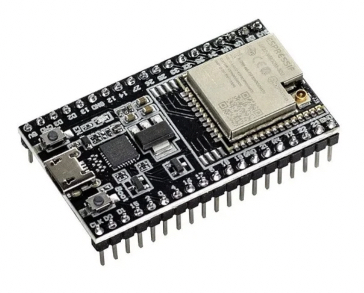
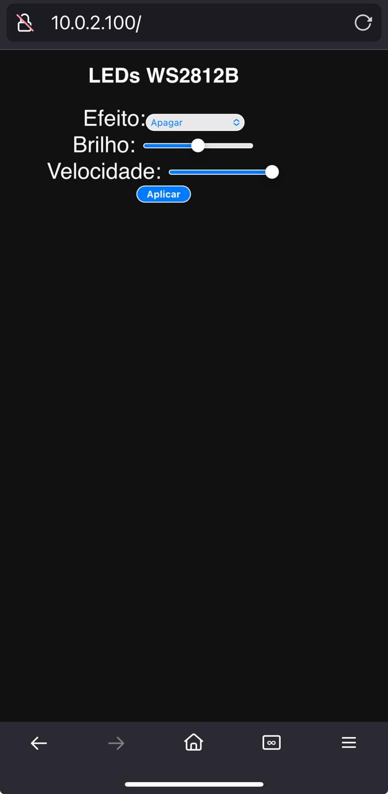

## 📑 Índice 

- [I. Introdução](#i-introdução)
- [II. Fita LED WS2812B](#ii-fita-led-ws2812b)
- [III. Alimentação e Interligação de Fitas LED WS2812 NeoPixel](#iii-alimentação-e-interligação-de-fitas-led-ws2812-neopixel)
- [IV. Conversor de Nível Lógico com ESP32](#iv-conversor-de-nível-lógico-com-esp32)
- [V. Controle da Fita WS2812B via Web com ESP32-WROOM](#v-controle-da-fita-ws2812b-via-web-com-esp32-wroom)
- [VI. Controle da Fita WS2812B com Tasmota](#vi-controle-da-fita-ws2812b-com-tasmota)
- [VII. Controle da Fita WS2812B com Arduino UNO R4 WiFi](#vii-controle-da-fita-ws2812b-com-arduino-uno-r4-wifi)
- [VIII. Fita de LED WS2815](#viii-fita-de-led-ws2815)

Este repositório demonstra como controlar uma fita de LED WS2812B (NeoPixel) utilizando:

- Um **ESP32** com Wi-Fi integrado,
- Ou um **Arduino UNO R4 WiFi** com sua matriz de LED on-board e suporte a Wi-Fi

Ambas as plataformas apresentam:

  - Uma **interface web responsiva**
  - Possibilidade, através de navegadores de :
    - Selecionar efeitos de iluminação
    - Ajustar a velocidade das animações
    - Controlar o brilho dos LEDs

Outra forma  possível é utilizar  o controle via **firmware TASMOTA**, ideal para integração com sistemas MQTT e automação residencial.

---

## I. Introdução

A forma mais simples de controlar esta fita de led endereçável é através do controlador RF. Esta forma de controle não é  o objeto deste repositório, mas estes controladores são de baixo custo e facilmente encontrados no mercado. 

O controlador RF compacto foi desenvolvido para o controle de fitas de LED endereçáveis, permitindo a seleção remota de múltiplos efeitos visuais com praticidade e versatilidade. Compatível com os principais chips de controle digital como WS2812B, APA102 e similares, o dispositivo suporta centenas de modos pré-programados, ajuste de velocidade, número de pixels e armazenamento automático do último estado utilizado.  

<p align="center">
  
</p>

O uso de fitas de LED endereçáveis com microcontroladores **ESP32** ou **Arduino** permite criar sistemas de iluminação altamente personalizáveis e interativos.

Para facilitar a integração com redes Wi-Fi e plataformas de automação como **Home Assistant** ou **Node-RED**, pode-se utilizar o firmware **[Tasmota](https://tasmota.github.io/)**. Ele transforma o microcontrolador em um **dispositivo inteligente pronto para uso**, acessível via navegador, com suporte embutido para **efeitos de luz, comandos MQTT, HTTP REST e atualizações OTA**.

Com o Tasmota, é possível configurar o comportamento da fita WS2812B diretamente pela interface web, definindo cores, modos animados (schemes), brilho, velocidade e horários de acionamento. Além disso, o dispositivo pode ser controlado **remotamente via MQTT**, **HTTP GET/POST** ou até mesmo por **comandos de voz**, através da integração com assistentes virtuais como Alexa ou Google Assistant.

Alternativamente, quem opta por programar diretamente o **ESP32** ou o **Arduino UNO R4 WiFi** pode implementar lógicas personalizadas em C++ com total liberdade, incluindo efeitos customizados, sensores e interações com interfaces web. A comunicação com plataformas de automação pode ser mantida via **publicação MQTT**, permitindo monitoramento e controle pela rede.

---

## II. Fita LED WS2812B

<p align="center">
  
</p>

## 🔧 Características principais

- **Tipo de LED:** WS2812B (com controlador embutido em cada LED)
- **Tensão de operação:** 5V DC
- **Comunicação:** 1 fio (protocolo serial)
- **Controle individual:** Cada LED pode ter cor e brilho próprios
- **Cores:** RGB (16 milhões de cores, controle PWM de 8 bits por canal)
- **Consumo:** ~60 mA por LED em brilho máximo (branco total)
- **Frequência de atualização:** Até 800 KHz
- **Endereçamento:** Dados em cascata (de um LED para o próximo)
- **Corte:** A cada LED ou grupo de LEDs (ver marcações na fita)

[Fita LED WS2812B RGB 5V no AliExpress](https://pt.aliexpress.com/item/1005007989431712.html?srcSns=sns_Copy&spreadType=socialShare&bizType=ProductDetail&social_params=21851383776&aff_fcid=6abde431cf2c43d78abba54f8fe92092-1748561979491-00334-_mq1jYKF&tt=MG&aff_fsk=_mq1jYKF&aff_platform=default&sk=_mq1jYKF&aff_trace_key=6abde431cf2c43d78abba54f8fe92092-1748561979491-00334-_mq1jYKF&shareId=21851383776&businessType=ProductDetail&platform=AE&terminal_id=fb8fc465198c41748a4019f7189cdc36&afSmartRedirect=y)

---

## 🛠️ Ligações básicas

<p align="center">
  
</p>

| Fita WS2812B | Função                            |
|--------------|-----------------------------------|
| **+5V**       | Alimentação                       |
| **GND**       | Terra (referência)               |
| **DIN**       | Entrada de dados (microcontrolador → fita) |
| **DOUT**      | Saída de dados (para próxima fita) |

> ⚠️ **Atenção:** Para microcontroladores de 3,3V (ESP32, Raspberry Pi), use **conversor de nível lógico** para o sinal de dados.

--- 

## 🔧 Características da fita utilizada

**Escala Cinzenta:** 256  
**Bits/Cor:** 8 Bits/Cor  

## Largura do PCB:
- 30 LEDs/m — 10mm  
- 60 LEDs/m — 10mm  
- 74 LEDs/m — 10mm  
- 96 LEDs/m — 10mm  
- 144 LEDs/m — 12mm  

**Cor FPC:** Preto/Branco  

**Taxa de Proteção:** IP30 / IP65 / IP67  

**Cores:** RGB em cores, mudança de cor de sonho  

**Cortável:** Cada LED é cortável  
 
**Double-sided copper**  
  - Folha de cobre de 35μm usada, com boa condutividade e redução de tensão
 
## 🧠 Aplicações comuns

- Iluminação RGB de ambientes
- Decoração de festas e Natal
- Ambientes gamers (modding de PC)
- Painéis e letreiros visuais
- Robótica e cosplay com luzes dinâmicas
- Luzes reativas a som

## ✅ Vantagens

- Controle individual por LED
- Integração fácil com microcontroladores
- Flexível, cortável e expansível
- Suporte por bibliotecas (FastLED, NeoPixel)

## ❌ Desvantagens

- Precisa de alimentação 5V estável
- Sensível a ruídos em longas distâncias
- Pode exigir capacitor e resistor para proteção

---

# III-Alimentação e Interligação de Fitas LED WS2812 (NeoPixel)

## 📌 Visão Geral

As fitas de LED WS2812 são endereçáveis individualmente e controladas via sinal digital. Elas exigem alimentação adequada e atenção especial ao sinal de controle para funcionarem corretamente.

---

## 🔋 Tensão e Corrente de Alimentação

- **Tensão**: **5V DC**
  - ⚠️ **Nunca alimente diretamente com 12V!**
- **Corrente por LED**: Até **60 mA** com brilho máximo (RGB = 255,255,255)
  - Fórmula:
    ```
    Corrente_total = 0.06 A × número_de_LEDs
    ```
  - Exemplo:
    - 60 LEDs → 60 × 0.06 A = **3.6 A**
    - 150 LEDs → 150 × 0.06 A = **9 A**

### ⚡ Fonte Recomendável

- Use fonte **5V com corrente adequada**:
  - Para 60 LEDs → 5V / 4A
  - Para 150 LEDs → 5V / 10A
- Tipos de fonte:
  - Fonte chaveada 5V
  - Fonte de bancada

---

## 🧬 Protocolo WS2812

- **Tipo**: Digital, com temporização precisa
- **Velocidade**: 800 kbps
- **Bits por LED**: 24 bits (8 para cada cor: **GRB**, não RGB)
- **Codificação**: Largura de pulso
  - `1`: HIGH ≈ 0.8 µs / LOW ≈ 0.45 µs
  - `0`: HIGH ≈ 0.4 µs / LOW ≈ 0.85 µs
- **Reset**: Um LOW de > 50 µs sinaliza o fim da transmissão

---

## 🔗 Interligação de Fitas

### Esquema com Múltiplas Fitas


- **GND comum** entre todas as fitas e o microcontrolador
- **+5V injetado a cada 1–2 metros** em fitas longas
- **Data Out de uma fita → Data In da próxima**

---

## 🛠️ Recomendações e Proteções

1. **Capacitor de 1000 µF / 6.3 V** entre +5V e GND na entrada da fita
2. **Resistor de 330 Ω** no fio de dados
3. **Use fios grossos** para +5V e GND em fitas longas (≥ 1,5 mm²)
4. **Se usar microcontrolador de 3.3V (ESP32, ESP8266)**:
   - Pode precisar de **level shifter** para o sinal de dados
5. **Nunca alimente pelo pino 5V do Arduino**, use fonte externa dedicada
   
---

## IV. Conversor de Nível Lógico com ESP32

## 📌 O que é um conversor de nível lógico?

Um **conversor de nível lógico** é um circuito que adapta sinais elétricos entre dispositivos que operam em diferentes tensões, como **3,3V** e **5V**.

---

## ⚠️ Por que é necessário?

Dispositivos como o **ESP32** ou **Raspberry Pi** operam em **3,3V**, enquanto a fita **WS2812B** geralmente requer sinais de **~5V** para funcionar de forma confiável.

Sem esse ajuste de nível:

- O sinal de dados de 3,3V pode não ser reconhecido corretamente pela fita.
- Isso pode causar efeitos como:
  - LEDs piscando incorretamente
  - Falhas intermitentes
  - LEDs travados

---

## ✅ Formas de conexão 

### 1. Módulo Conversor de Nível Lógico Bidirecional (MOSFET BSS138)

- Compatível com sinais de alta velocidade como o da WS2812B.
- Terminais:
  - **HV**: 5V da fonte
  - **LV**: 3,3V do ESP32
  - **GND**: comum entre ESP32 e fita
  - **LV1 → GPIO do ESP32**, **HV1 → DIN da fita WS2812B**

### 2. CI TTL Compatível: 74HCT245 ou 74HCT125

- Recomendado para buffers compatíveis com 3,3V.
- Usado para garantir a integridade do sinal em sistemas mais robustos.

### 3. Divisor Resistivo (não recomendado para WS2812B)

- Exemplo: Resistores de 1kΩ e 2kΩ.
- Reduz tensão de 5V para 3,3V, mas **não funciona bem para sinais rápidos** como os da WS2812B.

### 4. 🔌 Usando o Conversor de Nível Lógico IIC/I2C 

O módulo conhecido como **Conversor de Nível Lógico IIC/I2C bidirecional 5V ↔ 3.3V** (geralmente baseado no **MOSFET BSS138**) pode ser usado com segurança para **controlar fitas WS2812B** usando microcontroladores de 3,3V como o **ESP32**.

<p align="center">
  
</p>

Apesar de rotulado como “I2C”, esse módulo é um **conversor de nível lógico genérico**, ideal para sinais digitais de entrada/saída. O sinal da WS2812B:

- É **digital**
- É **unidirecional** (do ESP32 para a fita)
- Opera em **alta frequência (~800kHz)**

---

## 🔌 Exemplo de ligação

Use apenas **um canal** do conversor. Exemplo usando o canal **LV1/HV1**:

| Pino no Conversor | Conectar a                  |
|-------------------|-----------------------------|
| **HV**            | 5V da fonte da fita         |
| **LV**            | 3,3V do ESP32               |
| **GND**           | GND comum (ESP32 e fonte)   |
| **LV1**           | GPIO do ESP32 (ex: GPIO5)   |
| **HV1**           | DIN da fita WS2812B         |

> Os outros canais (LV2/HV2, etc.) não precisam ser usados.

---

## V. Controle da Fita WS2812B via Web com ESP32-WROOM

## O ESP32-WROOM

O **ESP32-WROOM** é um dos módulos da família ESP32 da Espressif, amplamente utilizado em projetos de automação, IoT e controle de dispositivos inteligentes. Ele combina um processador dual-core de 32 bits com clock de até 240 MHz, conectividade **Wi-Fi** e **Bluetooth** integradas, e um conjunto robusto de GPIOs multifuncionais. Esse módulo é ideal para aplicações que exigem desempenho, baixo consumo de energia e comunicação sem fio.

Possui suporte a protocolos como **MQTT**, **HTTP**, e bibliotecas como **ESPAsyncWebServer** ou **FastLED**, o ESP32-WROOM é capaz de controlar fitas WS2812B com alta eficiência e resposta em tempo real, tornando-se uma  escolha para sistemas de iluminação inteligentes, dashboards web, automação residencial e integração com plataformas como **Home Assistant** e **Node-RED**.

<p align="center">
  
</p>


## 📦 Requisitos do Projeto

- ESP32-WROOM
- Fita LED WS2812B (5V)
- Conversor de sinis lógicos 
- Fonte externa 5V (capaz de fornecer corrente suficiente)
- Arduino IDE com suporte à placa ESP32
- Biblioteca: [Adafruit NeoPixel](https://github.com/adafruit/Adafruit_NeoPixel)

---

## 🔧 Conexões da fita ao ESP32

| Fita WS2812B | ESP32                  |
|--------------|------------------------|
| DIN          | GPIO 5  (conversor)    |
| GND          | GND                    |
| +5V          | Fonte 5V               |

**Importante:** Conecte o GND da fonte e do ESP32 em comum.


## 🚀 Funcionalidades

- Servidor Web embutido no ESP32.
- Interface HTML moderna e responsiva (compatível com smartphones).
- Seis efeitos visuais:
  - Arco-íris contínuo
  - Correr (Knight Rider)
  - Teclado (preencher e apagar)
  - Piscada dupla
  - Chuva de LEDs
  - Branco estático
- Botões para:
  - Selecionar efeitos
  - Aumentar / diminuir **velocidade**
  - Aumentar / diminuir **brilho**
- Comunicação via AJAX (sem recarregar a página).

---

## 🌐 Interface Web

Acesse via navegador após o ESP32 se conectar à rede.  
Use o IP exibido no Serial Monitor, ex:

```plaintext
Conectado! IP: 192.168.0.105
```

## 📸 Controles disponíveis

- **Seção de efeitos:** Botões nomeados por efeito
- **Velocidade:** "Mais rápido" / "Mais lento"
- **Brilho:** "Aumentar" / "Diminuir"

---

## 🛠️ Como usar

1. Instale a biblioteca **Adafruit NeoPixel** na IDE do Arduino.
2. Substitua as credenciais de Wi-Fi no código:
   ```cpp
   const char* ssid = "SEU_SSID";
   const char* password = "SUA_SENHA";
   ```
3. Faça o upload do código para o ESP32.
4. Abra o navegador e acesse o IP mostrado no monitor serial.

---

## 📁 Estrutura do código

| Função                  | Descrição                                         |
|-------------------------|--------------------------------------------------|
| `setup()`               | Inicializa Wi-Fi, LEDs e servidor HTTP           |
| `loop()`                | Executa o efeito atual continuamente             |
| `/`                     | Rota principal: exibe a interface HTML           |
| `/efeito?id=N`          | Seleciona o efeito visual                        |
| `/velocidade?acao=...`  | Aumenta ou diminui a velocidade dos efeitos      |
| `/brilho?acao=...`      | Aumenta ou diminui o brilho da fita LED          |

---

## 📌 Dependências

- ESP32 core para Arduino
- Adafruit NeoPixel

Instale via: **Sketch > Incluir Biblioteca > Gerenciar Bibliotecas**

---

## VI. Controle da Fita WS2812B com Tasmota

O **Tasmota** é um firmware open-source altamente flexível para dispositivos ESP8266/ESP32, permitindo controle local e remoto via MQTT, HTTP, serial e interface web. Ele suporta uma ampla gama de sensores, relés e também **dispositivos de iluminação RGB endereçáveis**, como a **fita WS2812B**.

Este documento descreve como instalar e configurar o firmware **Tasmota** no **ESP32** para controlar uma fita de LED **WS2812B (NeoPixel)**, utilizando comandos via interface web ou MQTT.

[📘 Site Tasmota](https://tasmota.github.io)

[📘 Documentação Tasmota: WS2812B e WS2813 - Diagrama e Osciloscópio](https://tasmota.github.io/docs/WS2812B-and-WS2813/#about-this-circuit-diagram-and-the-oscilloscope-traces)

[📘 Documentação instalação Tasmota para dispositivos em geral](https://github.com/Epaminondaslage)

---

## 🔌 Por que usar Tasmota com a WS2812B?

Integrar a WS2812B com Tasmota permite:

- Controlar a fita via **interface web** (sem necessidade de programar).
- Integrar com assistentes como **Home Assistant**, **OpenHAB**, etc.
- Usar comandos MQTT ou HTTP para definir cor, brilho e efeitos.
- Fazer atualizações OTA e monitorar o status do dispositivo.

---

## ✅ Microcontroladores Recomendados

| Microcontrolador | Ideal para Tasmota com WS2812B? | Comentário                         |
|------------------|-------------------------------|------------------------------------|
| **ESP8266**      | ✅ Sim                         | Mais fácil, bem documentado        |
| **ESP32**        | ✅ Sim                         | Mais LEDs, mais potência           |
| Arduino UNO/R4   | ❌ Não                         | Não roda Tasmota                   |

---

## 🧭 Passo a passo: Instalar Tasmota no ESP32

### 1. Opções de Instalação

#### ✅ Opção A: Instalação via Navegador (recomendada)

1. Conecte seu ESP32 via USB
2. Acesse o site: [https://tasmota.github.io/install/](https://tasmota.github.io/install/)
3. Clique em **“Connect”**
4. Escolha sua porta USB e confirme
5. Selecione a opção **“Tasmota32”** (ou Tasmota32-Lite, Tasmota32-NEO etc.)
6. Clique em **“Install”**
7. Aguarde o processo de gravação e reinicialização

> ⚠️ Essa opção só funciona com navegadores **Chrome, Edge ou Chromium-based**, pois usa Web Serial API.

---

#### Opção B: Usando Tasmotizer

1. Baixe: https://github.com/tasmota/tasmotizer/releases
2. Conecte o ESP32 via USB
3. Selecione a porta e o firmware (`tasmota32.bin`)
4. Marque “Erase before flashing”
5. Clique em “Tasmotize!”

---

#### Opção C: Usando esptool.py

```bash
pip install esptool
esptool.py --port COM3 erase_flash
esptool.py --chip esp32 --port COM3 write_flash -z 0x1000 tasmota32.bin
```

---

### 2. Configurar o Wi-Fi

Caso a instalação seja feita pelo site ( Opção A) a configuracao do WIFI faz parte do processo. Caso seja outras opçoes, abra seu celular em configuraçoes de WIFI e siga o procedimento abaixo.

- Conecte-se à rede `Tasmota-XXXX`
- Acesse `192.168.4.1` no navegador
- Configure sua rede Wi-Fi local

---

### 3. Configurar o Módulo WS2812B

1. Vá em `Configuration > Configure Module`
2. Selecione: `Generic (18)`
3. Configure um GPIO (ex: GPIO5) como `WS2812`
4. Salve e reinicie

<p align="center">
  
</p>


### 4. Comandos Tasmota para LEDs

podem ser aplicados na console web do tasmota

| Comando         | Função                                 |
|-----------------|-----------------------------------------|
| `Power ON`      | Liga os LEDs                            |
| `Color 255,0,0` | Cor vermelha                            |
| `Fade ON`       | Transição suave                         |
| `Speed 1-20`    | Velocidade dos efeitos                  |
| `Scheme 0-5`    | Seleção de efeitos animados             |
| `Dimmer 0-100`  | Controle de brilho                      |

---

### 🔌 Esquema de Ligação

| Fita WS2812B | ESP32       |
|--------------|-------------|
| DIN          | GPIO5 (ex)  |
| GND          | GND         |
| VCC          | Fonte 5V externa (não use o 5V da USB) |

> Use resistor de 330Ω no fio de dados e capacitor de 1000µF entre VCC e GND.

<p align="center">
  
</p>


## 🧪 Teste Rápido

Envie estes comandos pela console da interface web Tasmota:

```
Color 0,0,255
Scheme 4
Speed 5
Fade ON
```

---

## VII. Controle da Fita WS2812B com Arduino UNO R4 WiFi

Este projeto utiliza o **Arduino UNO R4 WiFi** para controlar uma fita de LED **WS2812B (NeoPixel)**, com uma interface web moderna e responsiva. Os efeitos são selecionados via Wi-Fi usando botões interativos e são exibidos simultaneamente na **matriz de LED 12x8 integrada** da placa.

 **UNO R4 WiFi**   Inclui  **Wi-Fi, Bluetooth**, **LED Matrix**, **RTC** e **modo WebUSB**

<p align="center">
  
</p>

## 🔋 Comparativo: UNO R3 vs UNO R4

| Recurso                | UNO R3          | UNO R4 WiFi            |
|------------------------|------------------|-------------------------|
| MCU                    | ATmega328P (8-bit) | Renesas RA4M1 (32-bit)  |
| Clock                 | 16 MHz           | 48 MHz                 |
| Flash                 | 32 KB            | 256 KB                 |
| SRAM                  | 2 KB             | 32 KB                  |
| Conectividade         | Nenhuma          | Wi-Fi + Bluetooth      |
| Tensão lógica         | 5V               | 5V                     |
| Matriz de LEDs        | Não              | Sim                    |
| Compatível com shields antigos | Sim      | Sim                    |

---

## 🔧 Especificações Técnicas do Hardware utilizado neste projeto

| Item                      | Detalhes                                 |
|---------------------------|------------------------------------------|
| **Microcontrolador**      | Renesas RA4M1 ARM Cortex-M4 (48 MHz)     |
| **Memória Flash**         | 256 KB                                   |
| **SRAM**                  | 32 KB                                    |
| **Tensão de operação**    | 5V (compatível com shields UNO)          |
| **GPIOs**                 | 14 digitais, 6 analógicos, PWM, UART, I2C, SPI |
| **Tensão lógica dos pinos** | 5V (diferente do ESP32, que é 3.3V)       |
| **Porta USB**             | USB-C (com suporte a WebSerial/WebUSB)   |

---

## 🌐 Recursos extras do UNO R4 **WiFi**

| Recurso                  | Descrição                                  |
|--------------------------|---------------------------------------------|
| **Wi-Fi** e **Bluetooth**| Chip ESP32-S3 como co-processador de conectividade |
| **LED Matrix 12x8**      | Matriz de LED integrada controlável via I2C |
| **RTC (Relógio em tempo real)** | Alimentado com supercap para manter hora |
| **Memória Flash externa**| Para armazenar arquivos com LittleFS (ainda limitado no IDE Arduino) |

---

## 🧪 Exemplo de um Código (Arduino) para controlar fita LED WS2812B

```cpp
#include <Adafruit_NeoPixel.h>

#define PIN 6          // Pino onde a fita de LED está conectada
#define NUM_LEDS 400   // Número de LEDs na fita

Adafruit_NeoPixel strip(NUM_LEDS, PIN, NEO_GRB + NEO_KHZ800);

void setup() {
  strip.begin();
  strip.show(); // Garante que todos os LEDs comecem apagados
  randomSeed(analogRead(0)); // Inicializa gerador de números aleatórios
}

void loop() {
  // Gera uma nova cor aleatória (valores de 0 a 255 para R, G e B)
  byte r = random(0, 256);
  byte g = random(0, 256);
  byte b = random(0, 256);
  uint32_t corAleatoria = strip.Color(r, g, b);

  // Acende os LEDs um por um com a cor aleatória
  for (int i = 0; i < strip.numPixels(); i++) {
    strip.setPixelColor(i, corAleatoria);
    strip.show();
    delay(30);
  }

  delay(1000); // Espera com todos os LEDs acesos

  // Apaga os LEDs um por um
  for (int i = 0; i < strip.numPixels(); i++) {
    strip.setPixelColor(i, 0); // Desliga o LED i
    strip.show();
    delay(30);
  }

  delay(1000); // Espera antes do próximo ciclo
}

```
### Explicação

* random(0, 256) gera números de 0 a 255, usados para criar uma cor RGB aleatória.
* randomSeed(analogRead(0)) é usado no setup() para garantir que as cores sejam diferentes a cada execução do programa.
* O efeito visual permanece: acendimento progressivo, pausa, apagamento progressivo, pausa.

## 🎮 O repositório arduino_uno_wifi_ws2812 : Controle de Fita WS2812B via Web com Arduino UNO R4 WiFi

🔗 [Acessar repositório no GitHub](https://github.com/Epaminondaslage/fita_led_WS2812B/tree/main/arduino_uno_wifi_ws2812)

## ✅ O que o código faz?

Este projeto implementa um **servidor web local** usando o **Arduino UNO R4 WiFi** com a biblioteca `WiFiS3`, permitindo o **controle remoto de uma fita de LED WS2812B (NeoPixel)** com até 400 LEDs. **Após carregar o sketch no arduino ele mostra o IP que a placa obteve através da porta serial.** 

<p align="center">
  
</p>

Através de uma interface web acessível via navegador, o sistema oferece as seguintes funcionalidades:

- Selecionar diferentes **efeitos de iluminação**.
- Ajustar o **brilho** dos LEDs (0 a 255).
- Ajustar a **velocidade da animação** (em milissegundos).

---

## ✨ Funcionalidades incluídas

### 🎨 Efeitos disponíveis:

1. **Cores Aleatórias** – cada LED recebe uma cor aleatória ao longo da fita.
2. **Cometa** – efeito de um ponto de luz com rastro, simulando um cometa.
3. **Piscar** – todos os LEDs piscam em branco, alternando ligado/desligado.
4. **Arco-íris Estático** – um gradiente de cores fixo que percorre os LEDs.
5. **Apagar** – desliga todos os LEDs.
6. **Branco Frio** – todos os LEDs em branco puro (255, 255, 255).
7. **Branco Quente** – LEDs com tonalidade amarelada (255, 160, 60).
8. **Azul** – LEDs todos em azul puro.
9. **Verde** – LEDs todos em verde puro.
10. **Vermelho** – LEDs todos em vermelho puro.
11. **Arco-íris Rotativo** – gradiente colorido que se move continuamente pela fita.

---

## 📶 Interface Web

Após carregar o código no Arduino e conectá-lo à rede Wi-Fi:

1. Abra o **Monitor Serial** para ver o endereço IP.
2. Acesse esse IP via navegador (ex: `http://192.168.0.101`).
3. Use o formulário para:
   - Escolher o efeito desejado.
   - Ajustar brilho e velocidade.
   - Aplicar as mudanças em tempo real.

---

## 📦 Requisitos

- Arduino UNO R4 WiFi
- Fita WS2812B de até 400 LEDs
- Fonte de alimentação externa adequada (5V com corrente suficiente)
- Biblioteca:
  - [Adafruit NeoPixel](https://github.com/adafruit/Adafruit_NeoPixel)

---

## 📦 Componentes Usados

- **Arduino UNO R4 WiFi**
- **Fita WS2812B** conectada ao pino 6
- **Matriz de LED 12x8** on-board
- **Bibliotecas:**
  - `Adafruit_NeoPixel.h`
  - `Arduino_LED_Matrix.h`
  - `WiFiS3.h`

## VIII. Fita de LED WS2815

A **fita WS2815** é um tipo de fita de LED digital endereçável que oferece vantagens significativas sobre modelos anteriores como a WS2812B, sendo ideal para projetos de iluminação programável, decoração, automação e efeitos visuais complexos.

---

## 🔧 Características Técnicas

| Característica         | Detalhes                                                      |
|------------------------|---------------------------------------------------------------|
| **Modelo**             | WS2815                                                         |
| **Tipo de LED**        | SMD 5050 RGB com controle individual                           |
| **Tensão de operação** | **12V DC**                                                     |
| **Dados de controle**  | Protocolo serial com único fio de dados (mais fio de backup)  |
| **Nível lógico**       | 5V (entrada de dados)                                          |
| **PWM**                | ~2kHz (sem cintilação visível a olho nu)                      |
| **Redundância**        | Linha de dados dupla (continua operando mesmo se um LED falhar)|
| **Densidade típica**   | 30, 60, 96 ou 144 LEDs por metro                               |

---

## ✅ Vantagens da WS2815

- **Alimentação em 12V**: reduz quedas de tensão em fitas longas.
- **Resiliência a falhas**: com dois fios de dados, continua operando mesmo que um LED pare.
- **Controle independente**: cada LED pode ser configurado com cor e brilho únicos.
- **Mais robusta para instalações grandes**: menos perda por cabo, ideal para grandes projetos.

---

## ⚠️ Cuidados ao Usar

- **Alimentação adequada**:
  - Cada LED pode consumir até **0,3W** em branco total.
  - Exemplo: 60 LEDs consomem até **18W (~1,5A a 12V)**.
  - Fonte de qualidade é essencial para evitar instabilidade.

- **Capacitor recomendado**:
  - Coloque um **capacitor de 1000 µF / 16V** entre +12V e GND perto da fita.

- **Resistor no pino de dados**:
  - Use **330Ω** entre o microcontrolador e a fita para proteger o primeiro LED.

- **Nível lógico do sinal**:
  - A fita **espera 5V no sinal de dados**, mas ESP8266 e ESP32 usam 3,3V.
  - **Pode funcionar com 3,3V**, mas o ideal é usar um **conversor de nível lógico** (3,3V → 5V).

---

## 🔌 Alimentação e Conversão de Nível Lógico

Apesar da fita usar **12V para os LEDs**, o **sinal de dados é de 5V**. Para compatibilidade com microcontroladores modernos (como o ESP32 ou ESP8266, que operam com 3,3V), recomenda-se:

### ✅ Esquema de alimentação com uma única fonte:

- Use **uma fonte 12V** para:
  - Alimentar a fita diretamente.
  - Alimentar um **regulador step-down (buck)** que forneça 5V (para o lado "alto" do conversor de nível lógico).
  - Alimentar o ESP, se necessário.

### 🧠 Esquema de ligação resumido:

```
[Fonte 12V] ─┬─> Fita WS2815 (+12V / GND)
             ├─> Step-down 12V → 5V ──> HV do conversor
             └─> ESP32 / ESP8266 (via regulador ou USB)

ESP 3,3V ─────> LV do conversor
GND compartilhado entre todos os módulos
Saída do conversor ──> Pino de dados da WS2815
```

- **GNDs devem estar todos interligados.**
- O conversor usa 3,3V do ESP (LV) e 5V do step-down (HV).

---

## 📡 Compatibilidade com Tasmota

A fita  WS2815 pode ser usada com **Tasmota**, desde que:

### ✅ Requisitos:

- Microcontrolador com Tasmota instalado (ESP8266/ESP32)
- Tasmota com suporte a **FastLED / WS2812**
- Alimentação 12V para a fita
- Conversor de nível lógico (opcional, mas recomendado)

### ⚙️ Configuração no Tasmota:

1. **Acesse o Web UI do Tasmota**
2. Vá em **Configuration → Configure Module**
3. Selecione `Generic (18)`
4. Configure o GPIO como `WS2812 (4)`
5. Salve e reinicie

### 📜 Comandos no console:

```
LedTable 0            # Desativa mapeamento de brilho
SetOption15 1         # Ativa controle por cor direta
LedMode 1             # Modo de controle
PixelCount 60         # Número de LEDs na fita
```

### 📡 Exemplo de controle via MQTT:

```
cmnd/tasmota_WS2815/Color FF0000   # Todos os LEDs em vermelho
cmnd/tasmota_WS2815/Dimmer 50      # Brilho em 50%
```

---

## 💡 Aplicações Típicas

- Ambientes decorativos RGB
- Sinalização dinâmica
- Ambientes gamers e estúdios de vídeo
- Painéis de LED e obras de arte interativa
- Efeitos luminosos sincronizados com som
- Fachadas iluminadas e shows

---

## 🧾 Tabela Comparativa

| Característica              | WS2812B                         | WS2815                            |
|----------------------------|----------------------------------|-----------------------------------|
| **Tensão de Alimentação**  | 5V                               | **12V**                           |
| **Consumo por LED (RGB máx)** | ~60 mA                        | ~12 mA                            |
| **Número de Canais**       | 1 linha de dados (Data In/Out)  | **2 linhas** (Data + Backup)      |
| **Tolerância a Falhas**    | Um LED queimado interrompe tudo | **Linha de backup mantém funcionamento** |
| **Distância de Alimentação** | Baixa (perda de tensão rápida) | **Alta (perda menor com 12V)**    |
| **Compatibilidade**        | Alta (muito usada)              | Alta (usa o mesmo protocolo WS281x) |
| **Resistência a Ruído**    | Média                           | **Maior robustez**                |
| **Uso Recomendado**        | Projetos curtos (<2m), baratos  | **Instalações maiores e profissionais** |

---

## ⚠️ Considerações de Instalação

### WS2812B:
- Ideal para **curtas distâncias**
- Alimentação com **5V**
- Se um LED falhar, a fita inteira após ele para de funcionar
- Simples de usar com ESP32 (pode usar direto GPIO)

### WS2815:
- **Alimentação 12V** → permite **menos injeções de energia**
- Requer **conversor de nível lógico (3.3V → 5V)** para uso com ESP32
- Linha de **backup (BI)** evita falhas completas
- Perfeita para **projetos longos e resistentes a falhas**

---

## ✅ Recomendação

| Tipo de Projeto                           | Melhor escolha |
|------------------------------------------|----------------|
| Protótipo simples, portátil               | WS2812B        |
| Instalação longa (3m+), externa ou robusta| **WS2815**     |
| Ambientes industriais ou com ruído        | **WS2815**     |

---

## 📎 Observações

- Sempre conecte o **GND da fonte ao GND do ESP32**
- Use capacitor de 1000 µF entre V+ e GND da fita
- Use resistor de 330Ω no fio de dados para proteção
- Para longas distâncias, injete alimentação a cada 2-3 metros

---


