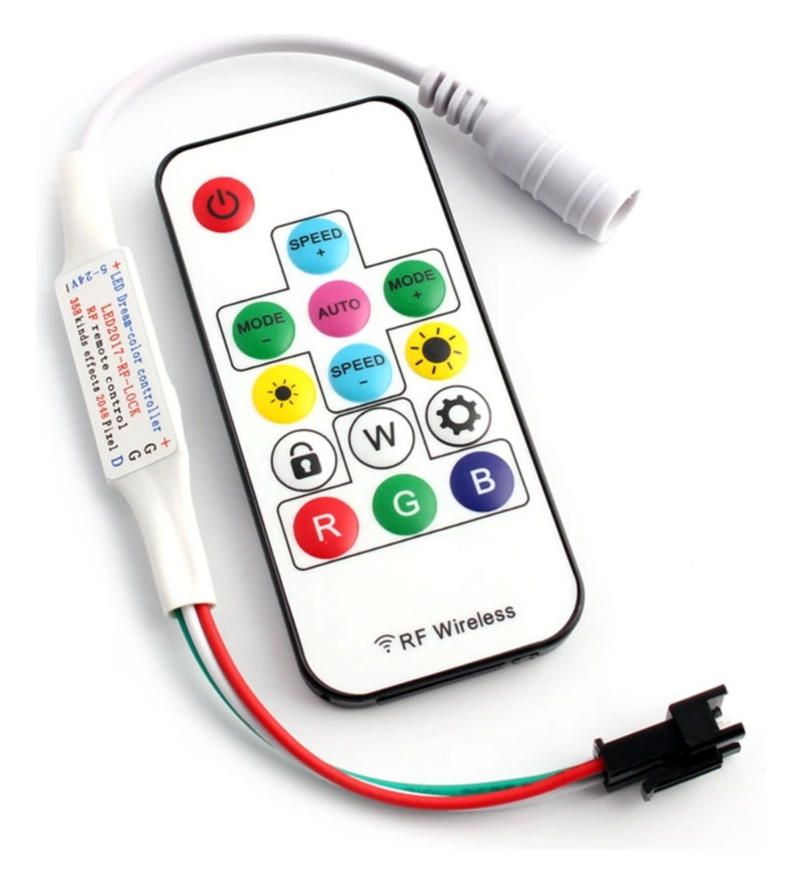
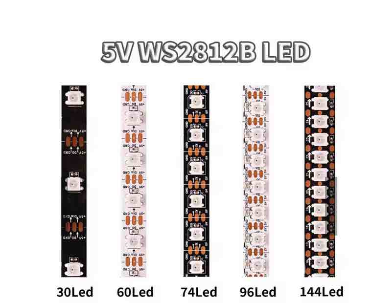
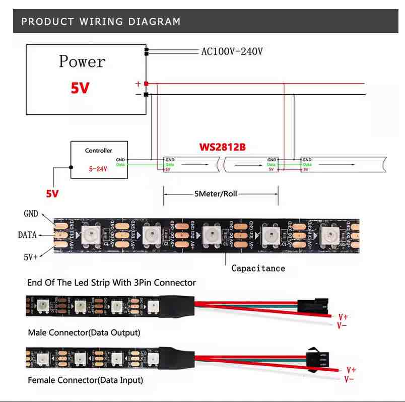
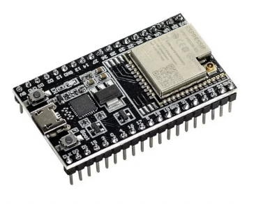
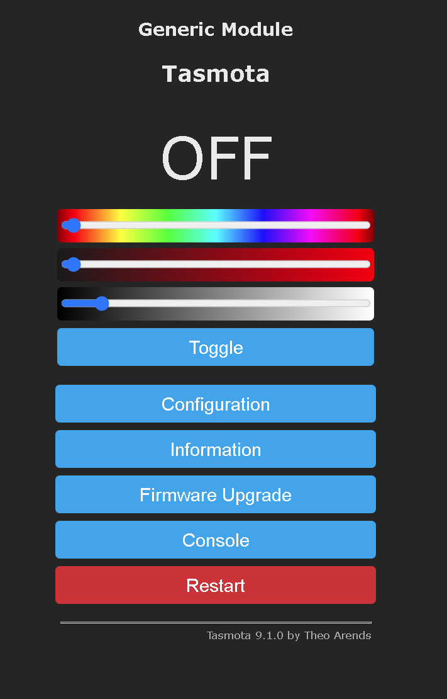
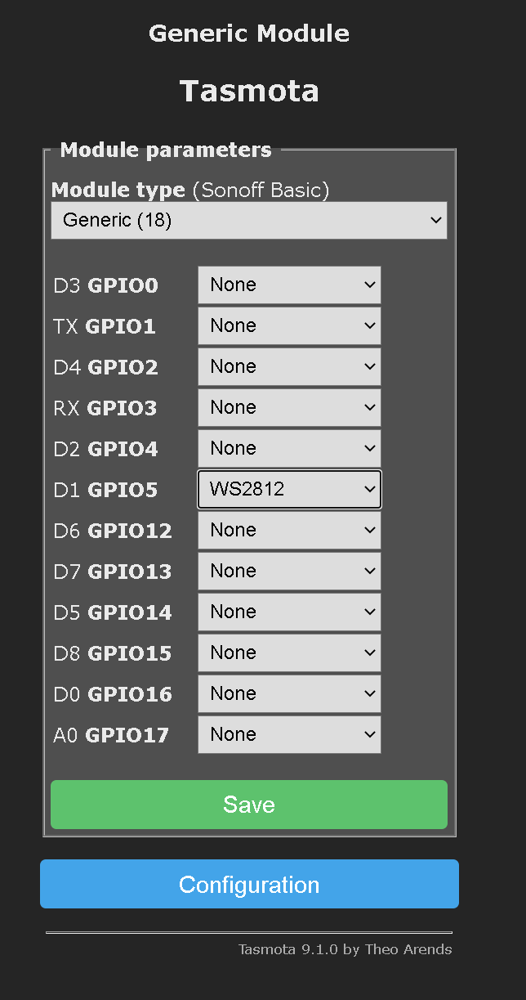
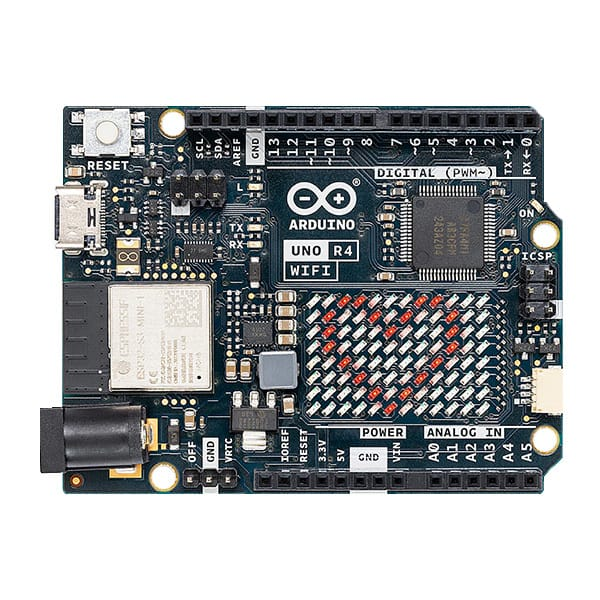
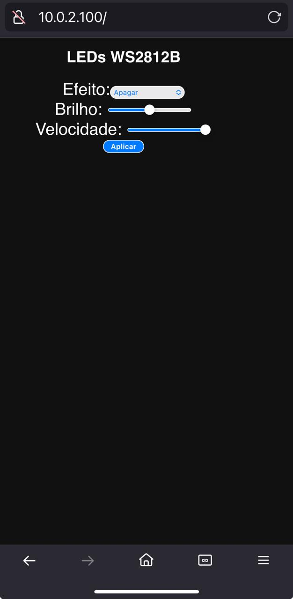

## Controle de Fitas de LED Endereçáveis com ESP32, Tasmota, Arduino e Painel de Controle Multifitas em php

Este repositório reúne uma coletânea de conteúdos técnicos e práticos sobre o controle de fitas de LED endereçáveis, com foco especial nos modelos WS2812B e WS2815. O objetivo é oferecer uma visão completa — do funcionamento básico das fitas até a implementação de sistemas de controle avançados via Wi-Fi, utilizando plataformas como ESP32-WROOM, Tasmota e Arduino UNO R4 WiFi.

Ao longo deste material, você encontrará explicações sobre os princípios de funcionamento das fitas NeoPixel, dicas de alimentação e interligação, uso de conversores de nível lógico, e diversos exemplos de controle via interface web. Também são abordadas as particularidades do uso de firmware Tasmota com LEDs endereçáveis e um comparativo entre diferentes modelos de fitas disponíveis no mercado.

## 📑 Índice 

- [I. Introdução](#i-introdução)
- [II. Fita LED WS2812B](#ii-fita-led-ws2812b)
- [III. Alimentação e Interligação de Fitas LED WS2812 NeoPixel](#iii-alimentação-e-interligação-de-fitas-led-ws2812-neopixel)
- [IV. Conversor de Nível Lógico](conversor-nivel-logico.md)
- [V. Controle da Fita WS2812B via Web com ESP32-WROOM](#v-controle-da-fita-ws2812b-via-web-com-esp32-wroom)
- [VI. Controle da Fita WS2812B com Tasmota](#vi-controle-da-fita-ws2812b-com-tasmota)
- [VII. Controle da Fita WS2812B com Arduino UNO R4 WiFi](#vii-controle-da-fita-ws2812b-com-arduino-uno-r4-wifi)
- [VIII. Fita de LED WS2815](Fita-de-LED-WS2815.md)
- [IX. Tasmota com fitas de LED endereçáveis](fitas_tasmota.md)
- [X. Painel de Controle de Fitas de LED em PHP](https://github.com/Epaminondaslage/fita_led_WS2812B/tree/main/fita_led_php))
- [XI. Comparativo entre fitas de LED Endereçáveis](modelos_fitas_led.md)
- [XII. Acionamento das fitas de LED por MQTT](https://github.com/Epaminondaslage/fita_led_mqtt)

---

## I. Introdução

A forma mais simples de controlar esta fita de led endereçável é através do controlador RF. Esta forma de controle não é  o objeto deste repositório, mas estes controladores são de baixo custo e facilmente encontrados no mercado. 

O controlador RF compacto foi desenvolvido para o controle de fitas de LED endereçáveis, permitindo a seleção remota de múltiplos efeitos visuais com praticidade e versatilidade. Compatível com os principais chips de controle digital como WS2812B, APA102 e similares, o dispositivo suporta centenas de modos pré-programados, ajuste de velocidade, número de pixels e armazenamento automático do último estado utilizado.  

<p align="center">
  
</p>

O uso de fitas de LED endereçáveis com microcontroladores **ESP32** ou **Arduino** permite criar sistemas de iluminação altamente personalizáveis e interativos.

Para facilitar a integração com redes Wi-Fi e plataformas de automação como **Home Assistant** ou **Node-RED**, pode-se utilizar o firmware **[Tasmota](https://tasmota.github.io/)**. Ele transforma o microcontrolador em um **dispositivo inteligente pronto para uso**, acessível via navegador, com suporte embutido para **efeitos de luz, comandos MQTT, HTTP REST e atualizações OTA**.

Com o Tasmota, é possível configurar o comportamento da fita WS2812B diretamente pela interface web, definindo cores, modos animados (schemes), brilho, velocidade e horários de acionamento. Além disso, o dispositivo pode ser controlado **remotamente via MQTT**, **HTTP GET/POST** ou até mesmo por **comandos de voz**, através da integração com assistentes virtuais como Alexa ou Google Assistant.

Alternativamente, quem opta por programar diretamente o **ESP32** ou o **Arduino UNO R4 WiFi** pode implementar lógicas personalizadas em C++ com total liberdade, incluindo efeitos customizados, sensores e interações com interfaces web. A comunicação com plataformas de automação pode ser mantida via **publicação MQTT**, permitindo monitoramento e controle pela rede.

---

## II. Fita LED WS2812B

<p align="center">
  
</p>

## 🔧 Características principais

- **Tipo de LED:** WS2812B (com controlador embutido em cada LED)
- **Tensão de operação:** 5V DC
- **Comunicação:** 1 fio (protocolo serial)
- **Controle individual:** Cada LED pode ter cor e brilho próprios
- **Cores:** RGB (16 milhões de cores, controle PWM de 8 bits por canal)
- **Consumo:** ~60 mA por LED em brilho máximo (branco total)
- **Frequência de atualização:** Até 800 KHz
- **Endereçamento:** Dados em cascata (de um LED para o próximo)
- **Corte:** A cada LED ou grupo de LEDs (ver marcações na fita)

[Fita LED WS2812B RGB 5V no AliExpress](https://pt.aliexpress.com/item/1005007989431712.html?srcSns=sns_Copy&spreadType=socialShare&bizType=ProductDetail&social_params=21851383776&aff_fcid=6abde431cf2c43d78abba54f8fe92092-1748561979491-00334-_mq1jYKF&tt=MG&aff_fsk=_mq1jYKF&aff_platform=default&sk=_mq1jYKF&aff_trace_key=6abde431cf2c43d78abba54f8fe92092-1748561979491-00334-_mq1jYKF&shareId=21851383776&businessType=ProductDetail&platform=AE&terminal_id=fb8fc465198c41748a4019f7189cdc36&afSmartRedirect=y)

---

## 🛠️ Ligações básicas

<p align="center">
  
</p>

| Fita WS2812B | Função                            |
|--------------|-----------------------------------|
| **+5V**       | Alimentação                       |
| **GND**       | Terra (referência)               |
| **DIN**       | Entrada de dados (microcontrolador → fita) |
| **DOUT**      | Saída de dados (para próxima fita) |

> ⚠️ **Atenção:** Para microcontroladores de 3,3V (ESP32, Raspberry Pi), use **conversor de nível lógico** para o sinal de dados.

--- 

## 🔧 Características da fita utilizada

**Escala Cinzenta:** 256  
**Bits/Cor:** 8 Bits/Cor  

## Largura do PCB:
- 30 LEDs/m — 10mm  
- 60 LEDs/m — 10mm  
- 74 LEDs/m — 10mm  
- 96 LEDs/m — 10mm  
- 144 LEDs/m — 12mm  

**Cor FPC:** Preto/Branco  

**Taxa de Proteção:** IP30 / IP65 / IP67  

**Cores:** RGB em cores, mudança de cor de sonho  

**Cortável:** Cada LED é cortável  
 
**Double-sided copper**  
  - Folha de cobre de 35μm usada, com boa condutividade e redução de tensão
 
## 🧠 Aplicações comuns

- Iluminação RGB de ambientes
- Decoração de festas e Natal
- Ambientes gamers (modding de PC)
- Painéis e letreiros visuais
- Robótica e cosplay com luzes dinâmicas
- Luzes reativas a som

## ✅ Vantagens

- Controle individual por LED
- Integração fácil com microcontroladores
- Flexível, cortável e expansível
- Suporte por bibliotecas (FastLED, NeoPixel)

## ❌ Desvantagens

- Precisa de alimentação 5V estável
- Sensível a ruídos em longas distâncias
- Pode exigir capacitor e resistor para proteção

---

# III-Alimentação e Interligação de Fitas LED WS2812 (NeoPixel)

## 📌 Visão Geral

As fitas de LED WS2812 são endereçáveis individualmente e controladas via sinal digital. Elas exigem alimentação adequada e atenção especial ao sinal de controle para funcionarem corretamente.

---

## 🔋 Tensão e Corrente de Alimentação

- **Tensão**: **5V DC**
  - ⚠️ **Nunca alimente diretamente com 12V!**
- **Corrente por LED**: Até **60 mA** com brilho máximo (RGB = 255,255,255)
  - Fórmula:
    ```
    Corrente_total = 0.06 A × número_de_LEDs
    ```
  - Exemplo:
    - 60 LEDs → 60 × 0.06 A = **3.6 A**
    - 150 LEDs → 150 × 0.06 A = **9 A**

### ⚡ Fonte Recomendável

- Use fonte **5V com corrente adequada**:
  - Para 60 LEDs → 5V / 4A
  - Para 150 LEDs → 5V / 10A
- Tipos de fonte:
  - Fonte chaveada 5V
  - Fonte de bancada

---

## 🧬 Protocolo WS2812

- **Tipo**: Digital, com temporização precisa
- **Velocidade**: 800 kbps
- **Bits por LED**: 24 bits (8 para cada cor: **GRB**, não RGB)
- **Codificação**: Largura de pulso
  - `1`: HIGH ≈ 0.8 µs / LOW ≈ 0.45 µs
  - `0`: HIGH ≈ 0.4 µs / LOW ≈ 0.85 µs
- **Reset**: Um LOW de > 50 µs sinaliza o fim da transmissão

---

## 🔗 Interligação de Fitas

### Esquema com Múltiplas Fitas


- **GND comum** entre todas as fitas e o microcontrolador
- **+5V injetado a cada 1–2 metros** em fitas longas
- **Data Out de uma fita → Data In da próxima**

---

## 🛠️ Recomendações e Proteções

1. **Capacitor de 1000 µF / 6.3 V** entre +5V e GND na entrada da fita
2. **Resistor de 330 Ω** no fio de dados
3. **Use fios grossos** para +5V e GND em fitas longas (≥ 1,5 mm²)
4. **Se usar microcontrolador de 3.3V (ESP32, ESP8266)**:
   - Pode precisar de **level shifter** para o sinal de dados
5. **Nunca alimente pelo pino 5V do Arduino**, use fonte externa dedicada
   
---

## IV. Conversor de Nível Lógico

[Veja o  aqui o repositório do conversor de nível lógico](conversor-nivel-logico.md)

---
## V. Controle da Fita WS2812B via Web com ESP32-WROOM

## O ESP32-WROOM

O **ESP32-WROOM** é um dos módulos da família ESP32 da Espressif, amplamente utilizado em projetos de automação, IoT e controle de dispositivos inteligentes. Ele combina um processador dual-core de 32 bits com clock de até 240 MHz, conectividade **Wi-Fi** e **Bluetooth** integradas, e um conjunto robusto de GPIOs multifuncionais. Esse módulo é ideal para aplicações que exigem desempenho, baixo consumo de energia e comunicação sem fio.

Possui suporte a protocolos como **MQTT**, **HTTP**, e bibliotecas como **ESPAsyncWebServer** ou **FastLED**, o ESP32-WROOM é capaz de controlar fitas WS2812B com alta eficiência e resposta em tempo real, tornando-se uma  escolha para sistemas de iluminação inteligentes, dashboards web, automação residencial e integração com plataformas como **Home Assistant** e **Node-RED**.

<p align="center">
  
</p>


## 📦 Requisitos do Projeto

- ESP32-WROOM
- Fita LED WS2812B (5V)
- Conversor de sinis lógicos 
- Fonte externa 5V (capaz de fornecer corrente suficiente)
- Arduino IDE com suporte à placa ESP32
- Biblioteca: [Adafruit NeoPixel](https://github.com/adafruit/Adafruit_NeoPixel)

---

## 🎮 O repositório esp32_ws2812B : Controle de Fita WS2812B via Web com Esp 32 WROOM

🔗 [Acessar repositório no GitHub](https://github.com/Epaminondaslage/fita_led_WS2812B/tree/main/esp32_ws2812B)

--- 

## 📋 Descrição

Este projeto permite controlar uma fita de LED WS2812B (NeoPixel) com até 400 LEDs usando um ESP32, via Wi-Fi, com uma interface web responsiva. O sistema conta com **15 efeitos visuais** pré-programados, controle de **brilho**, **velocidade** dos efeitos, **desligamento**, e **IP fixo** para facilitar a integração com sistemas externos (como painéis em PHP).

---

## 🚀 Funcionalidades

- Acesso via navegador (interface HTML responsiva para celular e desktop)
- 15 efeitos visuais com transições suaves
- Controle de brilho (0 a 255)
- Controle de velocidade (inversamente proporcional à responsividade)
- Modo "Desligar Fita"
- IP fixo configurado no ESP32
- Reset automático de variáveis ao mudar o efeito

---

## 🎨 Efeitos Disponibilizados

| ID  | Nome do Efeito           |
|-----|--------------------------|
| 0   | Confete                  |
| 1   | Cometa                   |
| 2   | Piscar                   |
| 3   | Arco-Íris                |
| 4   | Branco Frio              |
| 5   | Branco Quente            |
| 6   | Azul                     |
| 7   | Verde                    |
| 8   | Vermelho                 |
| 9   | Arco-Íris Rotativo       |
| 10  | Progressivo por Setores  |
| 11  | Ligar Sequencial         |
| 12  | Chuva de Estrelas        |
| 13  | Giro de Polícia          |
| 14  | Explosão Central         |
| 15  | **Desligar Fita**        |

---

## 🔧 Conexões da fita ao ESP32 Wroom DEV Kit

| Fita WS2812B | ESP32                  |
|--------------|------------------------|
| DIN          | GPIO 5  (conversor)    |
| GND          | GND                    |
| +5V          | Fonte 5V               |

**Importante:** Conecte o GND da fonte e do ESP32 em comum.

---

## 📶 Configuração de Rede

O ESP32 é configurado com IP estático (a rotina para DHCP está comentada e pode ser utilizada caso nao desejar ip fixo):

- **IP Local**: `10.0.2.240`
- **Gateway**: `10.0.2.1`
- **Subnet**: `255.255.255.0`
- **DNS Primário**: `8.8.8.8`
- **DNS Secundário**: `8.8.4.4`

```cpp
const char* ssid = "seu ssid";   // Nome da rede Wi-Fi
const char* pass = "sua senha";  // Senha da rede Wi-Fi
```

---

## 📦 Bibliotecas Necessárias

Instale via Gerenciador de Bibliotecas da IDE Arduino:

- **WiFi.h** (padrão para ESP32)
- **Adafruit NeoPixel**

---

## 🧪 Testando o Projeto

1. Compile e envie o código para o ESP32 via IDE Arduino.
2. Abra o **Monitor Serial** (baud 115200).
3. Aguarde a conexão com a rede e anote o **endereço IP** exibido.
4. Acesse via navegador: `http://<ip_do_esp32>`

---

## 🎨 Interface Web

A interface web permite:

- Selecionar efeitos - botões
- Ajustar brilho (slider 0–255)
- Ajustar velocidade (slider 1–200)
- Desligar a fita

--- 

## ⚙️ Ajustes Opcionais

- **Número de LEDs:** edite `NUM_LEDS`
- **Pino de dados:** edite `LED_PIN`

---

## 🔄 Reset de Variáveis

Ao mudar de efeito, o sistema automaticamente:

- Limpa o display
- Zera variáveis de animação
- Reposiciona contadores

Isso garante **transições suaves e corretas** entre efeitos.

---

## 🌐 Integração com PHP ou outros sistemas

Você pode controlar este sistema via requisições HTTP GET:

```
http://IP_da_Fita/config?efeito=3
http://IP_da_Fita/config?brilho=120
http://IP_da_Fita/config?vel=100
```

---


## VI. Controle da Fita WS2812B com Tasmota

O **Tasmota** é um firmware open-source altamente flexível para dispositivos ESP8266/ESP32, permitindo controle local e remoto via MQTT, HTTP, serial e interface web. Ele suporta uma ampla gama de sensores, relés e também **dispositivos de iluminação RGB endereçáveis**, como a **fita WS2812B**.

Este documento descreve como instalar e configurar o firmware **Tasmota** no **ESP32** para controlar uma fita de LED **WS2812B (NeoPixel)**, utilizando comandos via interface web ou MQTT.

[📘 Site Tasmota](https://tasmota.github.io)

[📘 Documentação Tasmota: WS2812B e WS2813 - Diagrama e Osciloscópio](https://tasmota.github.io/docs/WS2812B-and-WS2813/#about-this-circuit-diagram-and-the-oscilloscope-traces)

[📘 Documentação instalação Tasmota para dispositivos em geral](https://github.com/Epaminondaslage)

---

## 🔌 Por que usar Tasmota com a WS2812B?

Integrar a WS2812B com Tasmota permite:

- Controlar a fita via **interface web** (sem necessidade de programar).
- Integrar com assistentes como **Home Assistant**, **OpenHAB**, etc.
- Usar comandos MQTT ou HTTP para definir cor, brilho e efeitos.
- Fazer atualizações OTA e monitorar o status do dispositivo.

---

## ✅ Microcontroladores Recomendados

| Microcontrolador | Ideal para Tasmota com WS2812B? | Comentário                         |
|------------------|-------------------------------|------------------------------------|
| **ESP8266**      | ✅ Sim                         | Mais fácil, bem documentado        |
| **ESP32**        | ✅ Sim                         | Mais LEDs, mais potência           |
| Arduino UNO/R4   | ❌ Não                         | Não roda Tasmota                   |

---

## 🧭 Passo a passo: Instalar Tasmota no ESP32

### 1. Opções de Instalação

#### ✅ Opção A: Instalação via Navegador (recomendada)

1. Conecte seu ESP32 via USB
2. Acesse o site: [https://tasmota.github.io/install/](https://tasmota.github.io/install/)
3. Clique em **“Connect”**
4. Escolha sua porta USB e confirme
5. Selecione a opção **“Tasmota32”** (ou Tasmota32-Lite, Tasmota32-NEO etc.)
6. Clique em **“Install”**
7. Aguarde o processo de gravação e reinicialização

> ⚠️ Essa opção só funciona com navegadores **Chrome, Edge ou Chromium-based**, pois usa Web Serial API.

---

#### Opção B: Usando Tasmotizer

1. Baixe: https://github.com/tasmota/tasmotizer/releases
2. Conecte o ESP32 via USB
3. Selecione a porta e o firmware (`tasmota32.bin`)
4. Marque “Erase before flashing”
5. Clique em “Tasmotize!”

---

#### Opção C: Usando esptool.py

```bash
pip install esptool
esptool.py --port COM3 erase_flash
esptool.py --chip esp32 --port COM3 write_flash -z 0x1000 tasmota32.bin
```

---

### 2. Configurar o Wi-Fi

Caso a instalação seja feita pelo site ( Opção A) a configuracao do WIFI faz parte do processo. Caso seja outras opçoes, abra seu celular em configuraçoes de WIFI e siga o procedimento abaixo.

- Conecte-se à rede `Tasmota-XXXX`
- Acesse `192.168.4.1` no navegador
- Configure sua rede Wi-Fi local

---

### 3. Configurar o Módulo WS2812B

1. Vá em `Configuration > Configure Module`
2. Selecione: `Generic (18)`
3. Configure um GPIO (ex: GPIO5) como `WS2812`
4. Salve e reinicie

<p align="center">
  
</p>


### 4. Comandos Tasmota para LEDs

podem ser aplicados na console web do tasmota

| Comando         | Função                                 |
|-----------------|-----------------------------------------|
| `Power ON`      | Liga os LEDs                            |
| `Color 255,0,0` | Cor vermelha                            |
| `Fade ON`       | Transição suave                         |
| `Speed 1-20`    | Velocidade dos efeitos                  |
| `Scheme 0-5`    | Seleção de efeitos animados             |
| `Dimmer 0-100`  | Controle de brilho                      |

---

### 🔌 Esquema de Ligação

| Fita WS2812B | ESP32       |
|--------------|-------------|
| DIN          | GPIO5 (ex)  |
| GND          | GND         |
| VCC          | Fonte 5V externa (não use o 5V da USB) |

> Use resistor de 330Ω no fio de dados e capacitor de 1000µF entre VCC e GND.

<p align="center">
  
</p>


## 🧪 Teste Rápido

Envie estes comandos pela console da interface web Tasmota:

```
Color 0,0,255
Scheme 4
Speed 5
Fade ON
```

---

## VII. Controle da Fita WS2812B com Arduino UNO R4 WiFi

Este projeto utiliza o **Arduino UNO R4 WiFi** para controlar uma fita de LED **WS2812B (NeoPixel)**, com uma interface web moderna e responsiva. Os efeitos são selecionados via Wi-Fi usando botões interativos e são exibidos simultaneamente na **matriz de LED 12x8 integrada** da placa.

 **UNO R4 WiFi**   Inclui  **Wi-Fi, Bluetooth**, **LED Matrix**, **RTC** e **modo WebUSB**

<p align="center">
  
</p>

## 🔋 Comparativo: UNO R3 vs UNO R4

| Recurso                | UNO R3          | UNO R4 WiFi            |
|------------------------|------------------|-------------------------|
| MCU                    | ATmega328P (8-bit) | Renesas RA4M1 (32-bit)  |
| Clock                 | 16 MHz           | 48 MHz                 |
| Flash                 | 32 KB            | 256 KB                 |
| SRAM                  | 2 KB             | 32 KB                  |
| Conectividade         | Nenhuma          | Wi-Fi + Bluetooth      |
| Tensão lógica         | 5V               | 5V                     |
| Matriz de LEDs        | Não              | Sim                    |
| Compatível com shields antigos | Sim      | Sim                    |

---

## 🔧 Especificações Técnicas do Hardware utilizado neste projeto

| Item                      | Detalhes                                 |
|---------------------------|------------------------------------------|
| **Microcontrolador**      | Renesas RA4M1 ARM Cortex-M4 (48 MHz)     |
| **Memória Flash**         | 256 KB                                   |
| **SRAM**                  | 32 KB                                    |
| **Tensão de operação**    | 5V (compatível com shields UNO)          |
| **GPIOs**                 | 14 digitais, 6 analógicos, PWM, UART, I2C, SPI |
| **Tensão lógica dos pinos** | 5V (diferente do ESP32, que é 3.3V)       |
| **Porta USB**             | USB-C (com suporte a WebSerial/WebUSB)   |

---

## 🌐 Recursos extras do UNO R4 **WiFi**

| Recurso                  | Descrição                                  |
|--------------------------|---------------------------------------------|
| **Wi-Fi** e **Bluetooth**| Chip ESP32-S3 como co-processador de conectividade |
| **LED Matrix 12x8**      | Matriz de LED integrada controlável via I2C |
| **RTC (Relógio em tempo real)** | Alimentado com supercap para manter hora |
| **Memória Flash externa**| Para armazenar arquivos com LittleFS (ainda limitado no IDE Arduino) |

---

## 🧪 Exemplo de um Código (Arduino) para controlar fita LED WS2812B

```cpp
#include <Adafruit_NeoPixel.h>

#define PIN 6          // Pino onde a fita de LED está conectada
#define NUM_LEDS 400   // Número de LEDs na fita

Adafruit_NeoPixel strip(NUM_LEDS, PIN, NEO_GRB + NEO_KHZ800);

void setup() {
  strip.begin();
  strip.show(); // Garante que todos os LEDs comecem apagados
  randomSeed(analogRead(0)); // Inicializa gerador de números aleatórios
}

void loop() {
  // Gera uma nova cor aleatória (valores de 0 a 255 para R, G e B)
  byte r = random(0, 256);
  byte g = random(0, 256);
  byte b = random(0, 256);
  uint32_t corAleatoria = strip.Color(r, g, b);

  // Acende os LEDs um por um com a cor aleatória
  for (int i = 0; i < strip.numPixels(); i++) {
    strip.setPixelColor(i, corAleatoria);
    strip.show();
    delay(30);
  }

  delay(1000); // Espera com todos os LEDs acesos

  // Apaga os LEDs um por um
  for (int i = 0; i < strip.numPixels(); i++) {
    strip.setPixelColor(i, 0); // Desliga o LED i
    strip.show();
    delay(30);
  }

  delay(1000); // Espera antes do próximo ciclo
}

```
### Explicação

* random(0, 256) gera números de 0 a 255, usados para criar uma cor RGB aleatória.
* randomSeed(analogRead(0)) é usado no setup() para garantir que as cores sejam diferentes a cada execução do programa.
* O efeito visual permanece: acendimento progressivo, pausa, apagamento progressivo, pausa.

## 🎮 O repositório arduino_uno_wifi_ws2812 : Controle de Fita WS2812B via Web com Arduino UNO R4 WiFi

🔗 [Acessar repositório no GitHub](https://github.com/Epaminondaslage/fita_led_WS2812B/tree/main/arduino_uno_wifi_ws2812)

## ✅ O que o código faz?

Este projeto implementa um **servidor web local** usando o **Arduino UNO R4 WiFi** com a biblioteca `WiFiS3`, permitindo o **controle remoto de uma fita de LED WS2812B (NeoPixel)** com até 400 LEDs. **Após carregar o sketch no arduino ele mostra o IP que a placa obteve através da porta serial.** 

<p align="center">
  
</p>

Através de uma interface web acessível via navegador, o sistema oferece as seguintes funcionalidades:

- Selecionar diferentes **efeitos de iluminação**.
- Ajustar o **brilho** dos LEDs (0 a 255).
- Ajustar a **velocidade da animação** (em milissegundos).

---

## ✨ Funcionalidades incluídas

### 🎨 Efeitos disponíveis:

1. **Cores Aleatórias** – cada LED recebe uma cor aleatória ao longo da fita.
2. **Cometa** – efeito de um ponto de luz com rastro, simulando um cometa.
3. **Piscar** – todos os LEDs piscam em branco, alternando ligado/desligado.
4. **Arco-íris Estático** – um gradiente de cores fixo que percorre os LEDs.
5. **Apagar** – desliga todos os LEDs.
6. **Branco Frio** – todos os LEDs em branco puro (255, 255, 255).
7. **Branco Quente** – LEDs com tonalidade amarelada (255, 160, 60).
8. **Azul** – LEDs todos em azul puro.
9. **Verde** – LEDs todos em verde puro.
10. **Vermelho** – LEDs todos em vermelho puro.
11. **Arco-íris Rotativo** – gradiente colorido que se move continuamente pela fita.

---

## 📶 Interface Web

Após carregar o código no Arduino e conectá-lo à rede Wi-Fi:

1. Abra o **Monitor Serial** para ver o endereço IP.
2. Acesse esse IP via navegador (ex: `http://192.168.0.101`).
3. Use o formulário para:
   - Escolher o efeito desejado.
   - Ajustar brilho e velocidade.
   - Aplicar as mudanças em tempo real.

---

## 📦 Requisitos

- Arduino UNO R4 WiFi
- Fita WS2812B de até 400 LEDs
- Fonte de alimentação externa adequada (5V com corrente suficiente)
- Biblioteca:
  - [Adafruit NeoPixel](https://github.com/adafruit/Adafruit_NeoPixel)

---

## 📦 Componentes Usados

- **Arduino UNO R4 WiFi**
- **Fita WS2812B** conectada ao pino 6
- **Matriz de LED 12x8** on-board
- **Bibliotecas:**
  - `Adafruit_NeoPixel.h`
  - `Arduino_LED_Matrix.h`
  - `WiFiS3.h`


